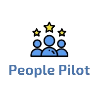
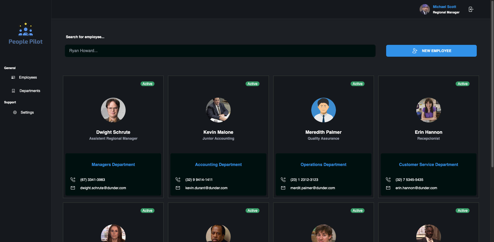
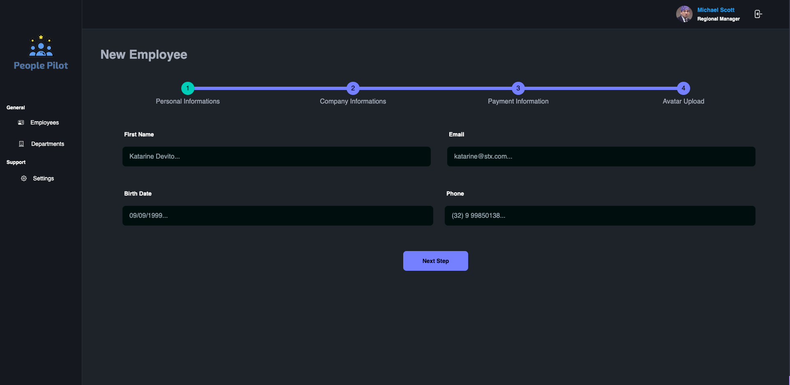
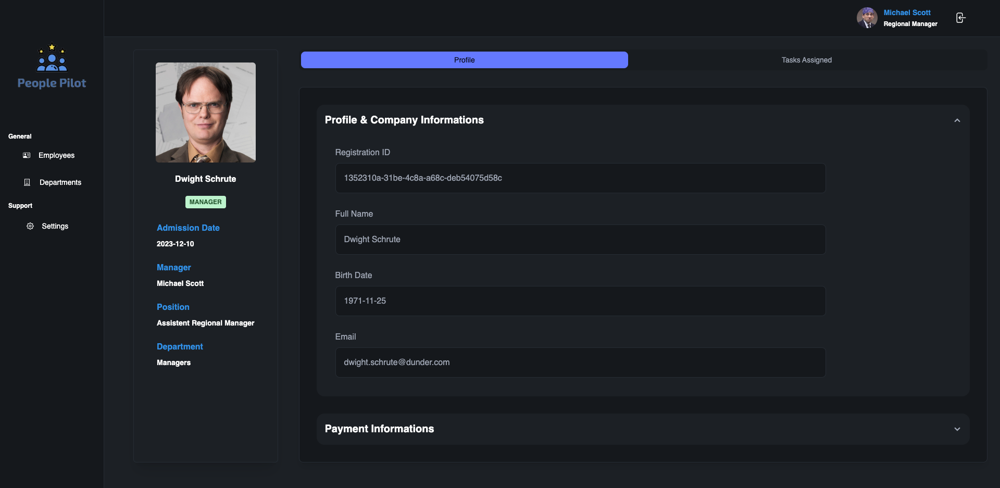
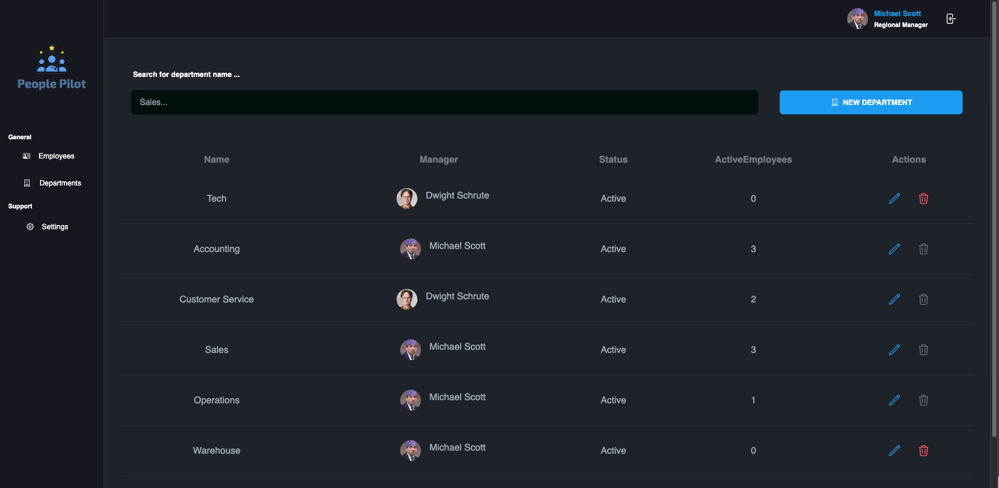
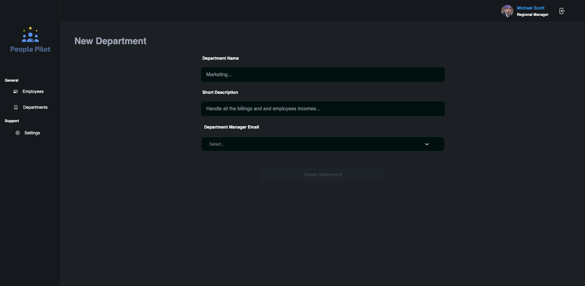

# People Pilot - Employee Management Platform 

 

## Introduction
People Pilot is a comprehensive employee management platform designed to streamline HR processes and enhance productivity in your organization. With a user-friendly interface and a suite of powerful tools, HR MAX simplifies the complexities of HR management.

## Features
- **Employee Management:** Centralized storage for all employee data, including personal information, job details and payment informations
- **Edit and Employee creation** Full journey for employee creating, including all necessary data

- **Departments Management:** Centralized operations for to edit, exclude and visualize company departments.

## Screenshots
 

*Detailed view of an employee list, with full support a pagination and filter*  

  

 *Detailed view of the employee creation processs*  

 
 
 *Detailed view of the employee details*

 

 *Detailed view of the departments list*

 

  *Detailed view of the departments list*